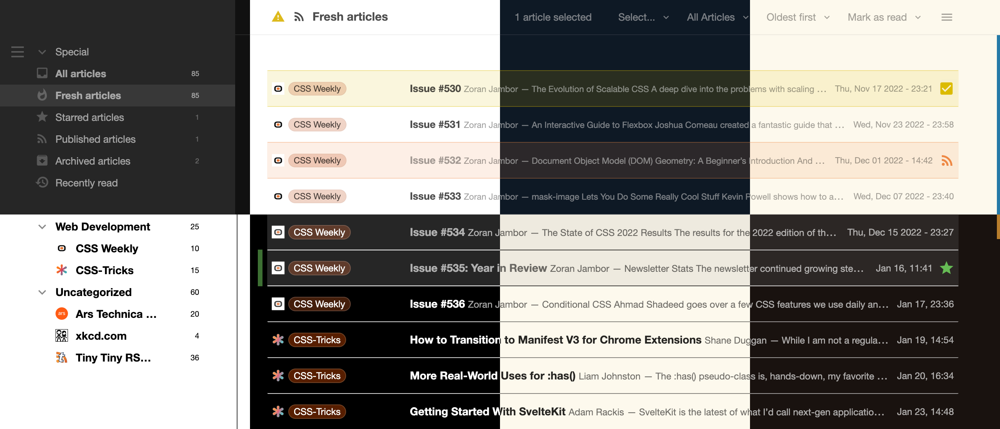
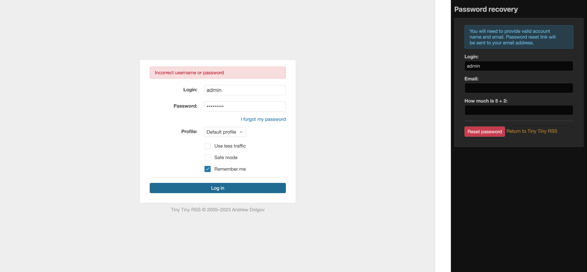
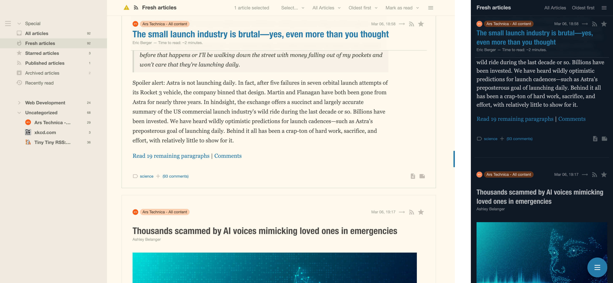
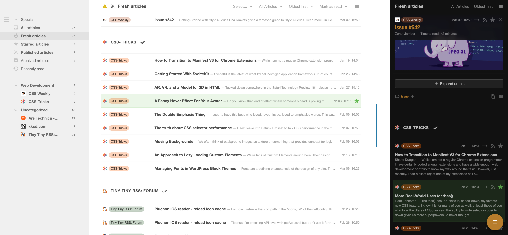
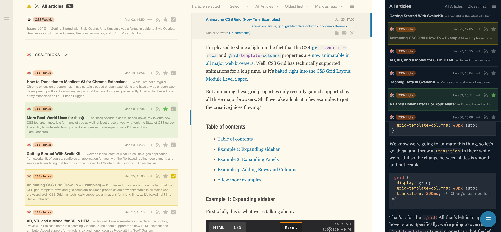
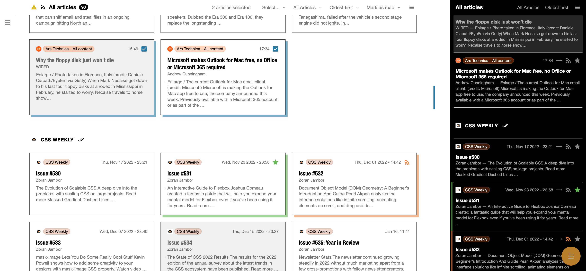
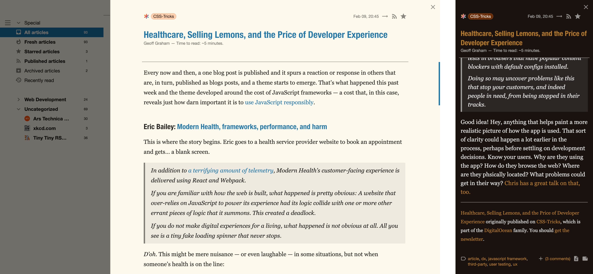
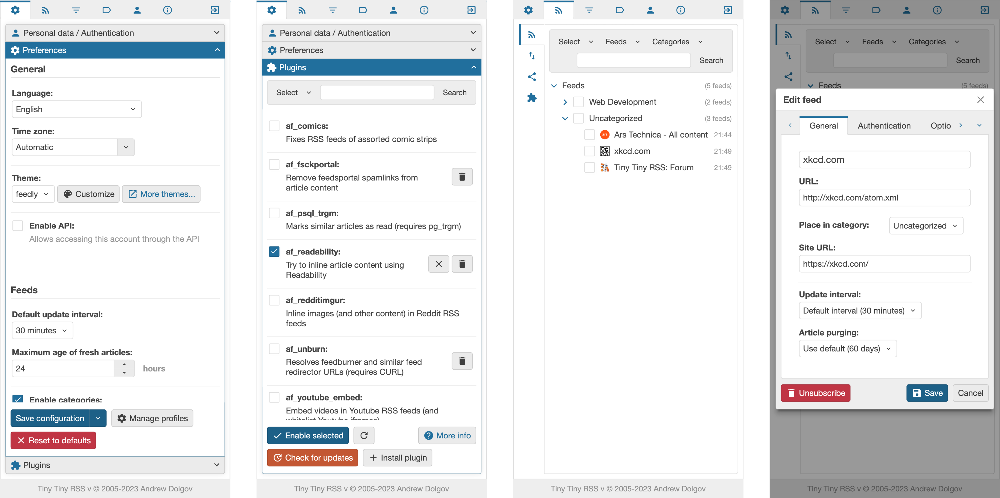

# Feedly theme for Tiny Tiny RSS

This is a theme for the popular self-hosted RSS reader [Tiny Tiny RSS](https://tt-rss.org) that provides a Feedly-inspired interface. Enjoy a clean, minimalist design that makes it easy to quickly scan and read your feeds.

For the best experience, please use a current browser.

## Quick Start

1. [Download the theme](levito/tt-rss-feedly-theme/archive/refs/heads/dist.zip) or clone the [_dist_ branch](https://github.com/levito/tt-rss-feedly-theme/tree/dist)
2. Unzip and copy the extracted files to `[tt-rss-root]/themes.local`
   - `feedly*.css` and the `feedly` directory are needed to get all theme variants
   - `local-overrides.js` is optional, it provides polyfills for Safari and prepares utility views for mobile-friendly styling
   - `local-overrides.css` is optional, but depends on `local-overrides.js` to customize the utility views
3. Go into your TT-RSS preferences and select the feedly theme.
4. Install/activate recommended plugins
   - `toggle_sidebar` for collapsing the feeds holder sidebar by clicking the left side of the screen
   - `shorten_expanded` to truncate long articles in expanded mode

## Features

- A clean, minimalist design that's easy on the eyes
- Responsive layout that works great on mobile devices
- An additional cards view that's not available with the default theme
- Different color variants with light and dark modes to match your personal preferences
- High contrast variants for improved accessibility
- Customizable fonts and spacing by setting CSS variables via the _Customize_ button
- Preferences theming and visual fixes
- Optional theming of the utility views (login, password recovery, share/subscribe bookmarklets, database update etc.)
- Support for various plugins

## Configuration

There are different color variants available. If you choose the _auto_ variants, your OS/browser will decide whether to use the light or dark color scheme.

You can configure the fonts and the UI spacing by using the _Customize_ button in the TT-RSS settings and adding/adjusting this chunk of CSS code:

```css
/* These are the default settings for feedly.css */
:root {
  --base-spacing: 45px; /* works best with a value between 30px and 75px */
  --font-size-post: 16px;
  --fonts-ui: "Helvetica Neue", Arial, Helvetica, "Liberation Sans",
    "Nimbus Sans L", FreeSans, sans-serif;
  --fonts-content: var(--fonts-ui);
  --fonts-heading: SansCn;
  --fonts-mono: "Fira Code", Menlo, Monaco, Consolas, "Lucida Console",
    "Liberation Mono", "DejaVu Sans Mono", "Bitstream Vera Sans Mono",
    "Courier New", monospace;
  --reading-width: 45; /* use a unitless `em` value */
  --card-max-column-count: 10;
  --card-min-column-width: 300px;
}
```

For a more compact spacing, try using the following custom CSS:

```css
:root {
  --base-spacing: 30px;
  --font-size-post: 14px;
}
```

## Development

In order to generate the CSS files, you will need to have Node.js and NPM installed.

1. Run `npm install` to install dependencies
2. Run `npm start` to watch `src` and compile on changes
3. Run `npm run dist` to build, compress and copy all needed files to `dist`  
   If you have a _dist_ branch on your fork, the new content of the `dist` directory will also be pushed to it

## FAQ

### Where are the CSS files? They used to be at the root level
CSS is now pushed to the [_dist_ branch](https://github.com/levito/tt-rss-feedly-theme/tree/dist). So now you can clone/download only the files that you need and don't need to check which files have to be copied for installation. Also, the _main_ branch commit history stays clean so it's easier to track changes.

### I don't want to copy the files every time – how do I stay up-to-date easily?
You can clone this repo and `git checkout dist` in it. Then change to your TT-RSS installation's `themes.local` directory and `ln -s [path/to]/tt-rss-feedly-theme/* .`. To update, just `git pull` in the theme's directory.

### I followed the installation steps but I don't get all the new features
Please make sure that you don't have an old copy of this theme in the `themes` directory of your TT-RSS installation. Third-party themes should go into the `themes.local` directory, but files in the `themes` directory will override any file with the same name in the `themes.local` directory.

### The theme looks broken
Please make sure to have the most recent version of TT-RSS installed (I test on [TT-RSS git master](https://dev.tt-rss.org/tt-rss/tt-rss)). Also, make sure to use a supported browser in the most recent version. If it's still broken, you might have found a bug. Feel free to open an issue or create a PR.

### Which browsers are supported?
This theme works best with Chromium-based browsers like Chrome, Brave, Edge, Vivaldi or Opera. Firefox and Safari are also supported but they're missing some minor features. On mobile devices, again, Chromium-based browsers on Android work best but Safari and other browsers on iOS should also work fine.

### What about tablets?
Tablets are also supported, both iPads and Android. The theme detects touch devices and will show all controls that would only be revealed on hover when using a desktop/laptop with a mouse/trackpad.

### Is there a way to quickly switch between light and night mode?
Yes, this theme is compatible with the [_toggle_night_mode_ plugin by ltGuillaume](https://github.com/ltGuillaume/FeedMei/tree/main/plugins.local). If you selected either a regular or a _night_ color variant, you can toggle back and forth by hitting `a N`. If you want your OS/browser to control this, select an _auto_ color variant.

### Can I change the colors via custom CSS?
It's not possible via CSS variables because colors are processed at build time. You can checkout the _main_ branch, edit `_variables.less` and build your own version of the theme.

### Why did you change the license?
I want this theme to have a proper, well-recognized license to make it clear and easy for others to use this code as source or part of their work. In contrast to the previously used WTFPL, the MIT license is very popular, permissive, short and clear. Please include the license with the copyright notice in any copy or fork.

## Screenshots

This is a selection to give you an impression of what to expect.


_Available color variants. Top: default night, default light, sepia night, sepia light  
Bottom: high contrast, high contrast night, sepia contrast, sepia contrast night_

---


_Login in light mode, password recovery in dark mode on mobile_

---


_Combined view expanded with sepia color variant, mobile in night mode_

---


_Combined view, expand selected atricle only, grouped by feed, mobile in night mode_

---


_Split view, desktop in widescreen mode, mobile non-widescreen in night mode_

---


_Cards overview (enable grid, combined view, and expand selected article only) with high contrast variant_

---


_Cards detail (opens as a layer similar to Feedly) with sepia contrast color variant_

---


_Preferences on mobile: main, plugins, feeds, edit feed_
